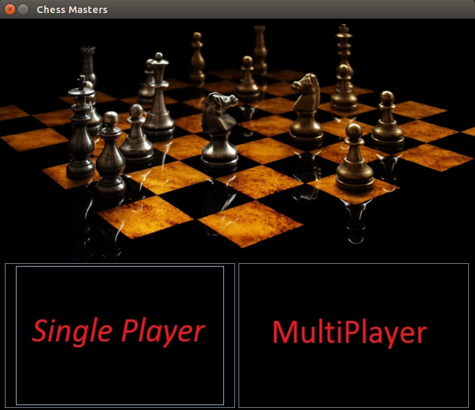
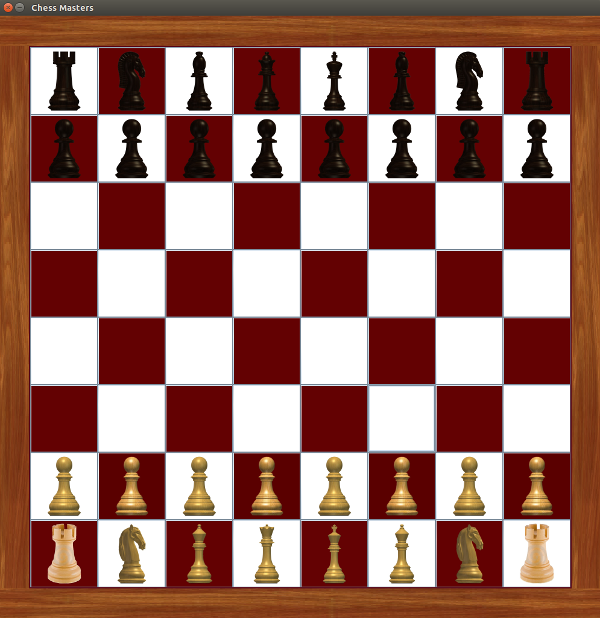
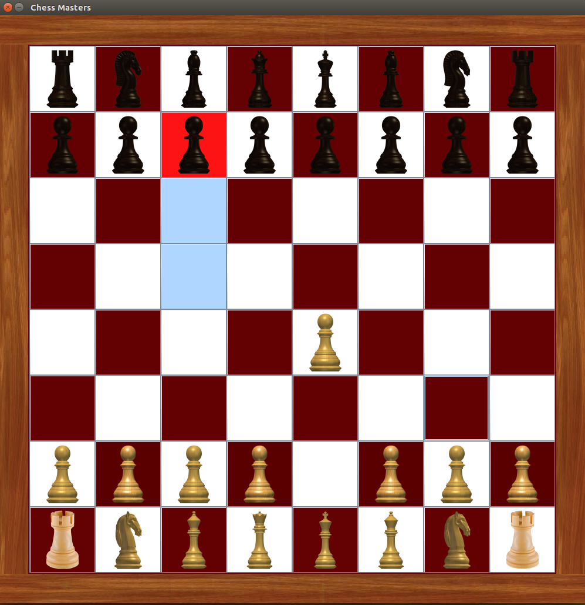

# Chess-Game
A rule enforcing Chess multi-player Game implemented from Scratch using Java.
No third party libraries have been used in the making of this game. Everything is pure Java.

##Chess Game Start Screen

##Starting Board Layout

##Playing the Game

##Chess Rule Enforcing - Queen's Available Moves
.png)

##Chess Rule Enforcing - The available moves will be constricted when the king is on Check
.png)
